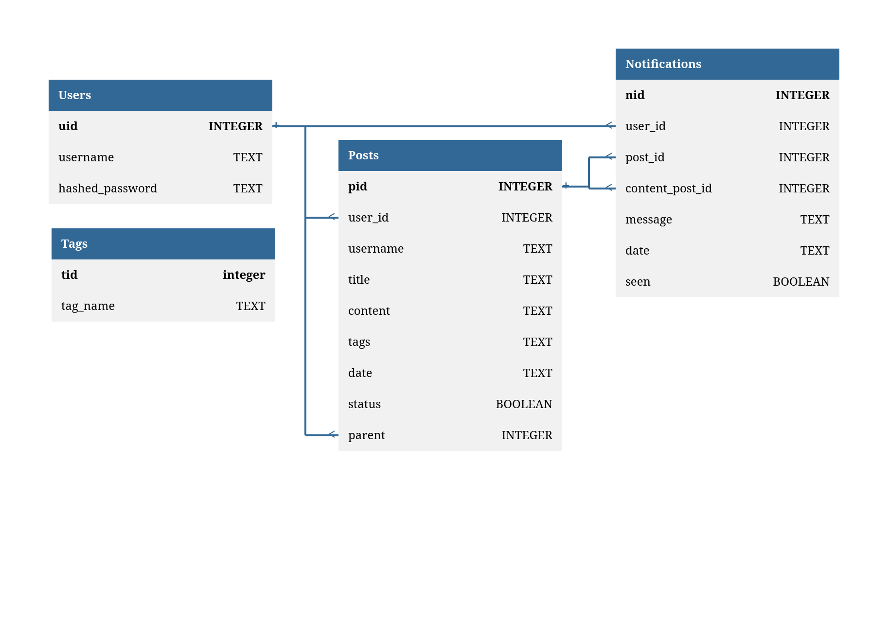

# bulletin-and-notification-dashboard
Fullstack project. Features both a frontend built in react-vite, and a backend that manages the database and other requests
- Create, edit, and delete posts
- Comment on other posts
- Get notifications when others comment on your post (notification list after clicking bell icon)
- Sort by date or title (descending or ascending), in addition to sorting by applying tags or by search terms
- Authorization token for your convenience after logging in
  
## Demo
Video demo: https://drive.google.com/file/d/1aYN_ZDtnX0nmU3gnD7zyFWaBzbjBMdNX

## Run
Navigate into band-client and band-server and run `npm install`.

In band-client, run `npm run preview -- --host`.

In band-server, run `npm run dev` or `node --watch --env-file=.env --experimental-strip-types --experimental-sqlite ./src/server.js`.

Both will output what local IP address the server is running on in the terminal. 

## Documentation:
https://tkf882.github.io/bulletin-and-notification-dashboard/

## Database

